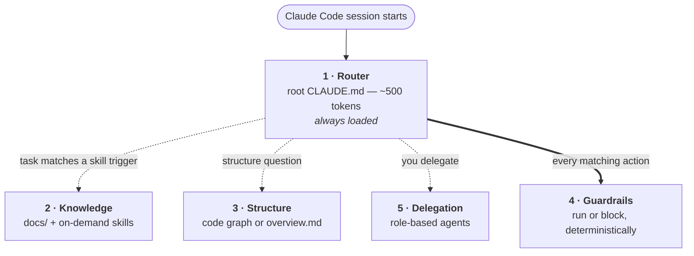

<div align="center">

# ⭐ Lodestar

**Turn a folder of repositories into one coordinated, self-documenting project for Claude Code.**

*No monorepo migration. No `CLAUDE.md` in every repo.*

[](https://github.com/Miyunecadz/lodestar/actions/workflows/ci.yml)
[](https://github.com/Miyunecadz/lodestar/releases)
[](LICENSE)
[](#-requirements)
[](#-requirements)

[Quickstart](#-quickstart) · [How it works](#-the-five-layers) · [Catalog](kit/catalog/CATALOG.md) · [Architecture](docs/ARCHITECTURE.md) · [Walkthrough](examples/walkthrough.md)

</div>

> A *lodestar* is the star you steer by. In a multi-repo workspace, the root is that fixed point: it holds the map of the whole system so the AI can orient itself, then hands narrow, well-scoped work to the right place.
>
> **Map at the top, hands at the bottom.**

---

## 🧭 The problem

You have several repos in one folder — a `backend`, a `frontend`, a `mobile` app. You want Claude Code to understand the *whole system*, not one repo at a time.

Every naive fix costs you something:

| The naive fix | What it costs you |
|---|---|
| ❌ A `CLAUDE.md` in every repo | Duplicated conventions, drift between them, and still no cross-repo picture |
| ❌ One giant root `CLAUDE.md` | Tens of thousands of tokens on *every* session — most irrelevant to the task in hand |
| ❌ Hand-written architecture docs | Stale the moment the code changes |

**What you actually want:** one launch point, a tiny always-on index, and everything else arriving only when the task calls for it.

## 💡 The idea

Lodestar puts a **thin router** at the workspace root and moves all real knowledge into layers that **load only when relevant** — each carrying an explicit *"when to load this"* trigger. A new repo is absorbed by one command. Everything is plain files you can copy, publish, and modify.

```
your-workspace/                 ← launch Claude Code from here
├── CLAUDE.md                   ← thin router: repo registry + "load on demand"
├── docs/
│   ├── _shared/                ← cross-repo truth (the API contract, env tiers, auth…)
│   └── <repo>/architecture/    ← code graph (Graphify) or a Markdown overview.md
├── .claude/
│   ├── skills/                 ← knowledge that loads only when the task matches
│   ├── agents/                 ← opt-in role workers you delegate to
│   ├── commands/               ← the generators (see below)
│   ├── hooks/                  ← the bundled guardrail engine (lodestar-guardrails.py)
│   └── guardrails/             ← opt-in guardrail rules (enforced, not advisory)
├── backend/                    ← untouched, still its own git repo
├── frontend/                   ← untouched
└── mobile/                     ← untouched
```

## 🧱 The five layers

Each layer is optional and does exactly one job. Only the router is always loaded.



<sub>Dotted = pulled in on demand, advisory. **Thick = fires deterministically, enforced.**</sub>

| Layer | What it is | Loads / fires | Advisory or enforced |
|---|---|---|---|
| **1. Router** | thin root `CLAUDE.md` | every session (tiny) | — |
| **2. Knowledge** | `docs/` + on-demand **skills** | when the task matches a skill's `description` | advisory |
| **3. Structure** | **Graphify** code graph per repo (or a Markdown `overview.md` if Graphify isn't installed) | queried on demand | advisory |
| **4. Guardrails** | `.claude/guardrails/*.md` rules + a bundled engine, a pre-commit checker, and `permissions.deny` | deterministically, on every matching action | **enforced** |
| **5. Delegation** | role-based **agents** | when you (or an orchestrator) delegate | advisory |

> [!IMPORTANT]
> **Docs make the AI *informed*; guardrails make it *trustworthy*.**
>
> Use knowledge and skills for judgment and style. Use guardrails for anything where a mistake has real cost — database migrations, secrets, generated files.

## ⚙️ The generators

Everything self-extends through commands that share one engine:

**detect the stacks present → filter a catalog → let you pick from a menu → write only what you chose → record it in a manifest**

| Command | Produces | Destructive? |
|---|---|---|
| `/lodestar-init` | the router, `docs/_shared/` skeleton, `repo-map.md` | no |
| `/lodestar-onboard <path>` | a repo's docs + architecture map (Graphify graph or Markdown overview) + matching skill | no (informational) |
| `/lodestar-guardrails` | opt-in enforced rules (a checklist you tick) | writes rules |
| `/lodestar-agents` | opt-in role agents (a checklist you tick) | writes agents |

Add a new repo later? `/lodestar-onboard ./new-service` and it's absorbed — the router never changes.

<details>
<summary><b>Keeping the map fresh · <code>/lodestar-freshness</code> and <code>/lodestar-refresh</code></b></summary>

<br/>

Because the router tells agents to *trust* the architecture map over re-reading source, a stale map doesn't merely underperform — it actively misleads. Two opt-in mechanisms keep it honest:

- **Graphify repos** get a **lockstep pre-commit rebuild**: the refreshed graph rides in the same commit as the code. Deterministic, offline, ~1s, and it never blocks a commit.
- **Markdown repos** get **drift detection** — regeneration needs a model pass, so it is never silent. `/lodestar-refresh <repo>` re-runs it on demand.

Both are installed by `/lodestar-freshness` into your existing git-hook manager (lefthook, husky, `core.hooksPath`, or plain) without clobbering what's there.

</details>

<details>
<summary><b>Updating · <code>/lodestar-update</code></b></summary>

<br/>

Run **`/lodestar-update`** from the workspace. It fetches the latest **released version** and re-syncs the kit (catalog, templates, commands, guardrail engine) **without touching anything you generated** — your rules, agents, docs, and manifest are left exactly as they are.

New catalog entries appear the next time you re-run `/lodestar-guardrails` or `/lodestar-agents`.

Updates move between release tags, never to the tip of `main`, so they're reproducible and reversible:

```bash
/lodestar-update 0.5.0     # pin or roll back to a specific version
```

</details>

## 🚀 Quickstart

**1. Install into the workspace that contains your repos.** Fetches the latest release, copies the kit in, leaves no clone behind.

```bash
curl -fsSL https://raw.githubusercontent.com/Miyunecadz/lodestar/main/install.sh \
  | bash -s -- ~/code/my-workspace
```

**2. Launch Claude Code from the workspace root and configure it.**

```bash
cd ~/code/my-workspace
claude
```
```
> /lodestar-init
> /lodestar-onboard ./backend
> /lodestar-onboard ./frontend
> /lodestar-guardrails    # tick the safety + quality rules you want
> /lodestar-agents        # tick the role agents you want
```

That's it. Nothing is enforced or generated until you run those commands.

<details>
<summary><b>Other install paths</b> — read-before-run, offline, air-gapped, version-pinned</summary>

<br/>

**Prefer to read a script before running it?** Download it first — same result:

```bash
curl -fsSLO https://raw.githubusercontent.com/Miyunecadz/lodestar/main/install.sh
less install.sh && bash install.sh ~/code/my-workspace
```

**Install from a clone (offline, air-gapped, or contributing).** The installer copies from a `kit/` directory next to itself when there is one, so this path needs no network at all:

```bash
git clone https://github.com/Miyunecadz/lodestar.git ~/tools/lodestar
# (or via SSH: git clone git@github.com:Miyunecadz/lodestar.git ~/tools/lodestar)
~/tools/lodestar/install.sh ~/code/my-workspace
```

A clone install records the clone's **path**, so `/lodestar-update` keeps doing `git pull` + re-install from it — offline updates keep working. A bootstrap install records the **repo URL and tag** instead, and updates re-fetch from there. Either way `.lodestar/` holds metadata, not a clone.

**Pin a specific version:**

```bash
bash install.sh ~/code/my-workspace --ref v0.6.0     # any release from v0.5.0 onward
```

</details>

> [!NOTE]
> **Users vs contributors.** As a user you never need a clone: bootstrap, then configure with the slash commands. As a contributor you want the clone — it's the product source, and this repo's own `.claude/` is dev tooling, not part of the kit. See [`CONTRIBUTING.md`](CONTRIBUTING.md).

## 🎯 Design principles

<table>
<tr><td width="34%">

**1 · When-to-load is a first-class field**

</td><td>

Every skill and doc states the task it belongs to, so the AI never loads planning docs while coding, or coding standards while planning.

</td></tr>
<tr><td>

**2 · Single source of truth**

</td><td>

Knowledge lives in one place — a skill or a doc. Agents and commands *reference* it; they never copy it. Copies drift.

</td></tr>
<tr><td>

**3 · Breadth at the top, depth in the workers**

</td><td>

The orchestrator holds the wide map; delegated agents are narrow roles with a crisp done-condition. Narrow *task* scope — not narrow *domain* — is what prevents drift.

</td></tr>
<tr><td>

**4 · Advisory vs enforced is a deliberate choice**

</td><td>

And *enforced by what* is a second one. A safety rule declares its surfaces: Claude's tool calls, every committer's pre-commit, `permissions.deny`, or several at once. A rule that only constrains the assistant is labelled as such rather than implying more.

</td></tr>
<tr><td>

**5 · Everything is a copyable file**

</td><td>

The catalog *is* the product. Fork it, delete what you dislike, add your own.

</td></tr>
</table>

## 🚫 What Lodestar is *not*

- **Not a monorepo tool** — your repos stay independent, with their own git history and CI.
- **Not a replacement for Claude Code features** — it's a disciplined way to *arrange* them (skills, hooks, agents, MCP scopes).
- **Not opinionated about your stack** — the catalog is a **universal core** (works anywhere) plus **stack packs** that activate only when detected.

  Ships with **Node · GraphQL · React · React Native**, **Python · Django**, **Laravel · PHP**, and **Next.js**. Every entry is stack-tagged and easy to swap or extend. When a repo's stack has *no* pack, onboarding says so and generates a `docs/EXTENDING.md` describing how to add one, rather than quietly falling back to the universal core. See [`kit/catalog/CATALOG.md`](kit/catalog/CATALOG.md).

## 📚 Documentation

| | |
|---|---|
| [`docs/ARCHITECTURE.md`](docs/ARCHITECTURE.md) | The full design, and the rationale behind every decision |
| [`docs/CONCEPTS.md`](docs/CONCEPTS.md) | The mental models — advisory vs enforced, map/hands, the loading policy |
| [`docs/EXTENDING.md`](docs/EXTENDING.md) | How to add your own guardrails, agents, and skills |
| [`kit/catalog/CATALOG.md`](kit/catalog/CATALOG.md) | The grouped index: universal core + stack packs |
| [`kit/catalog/README.md`](kit/catalog/README.md) | The catalog entry format |
| [`examples/walkthrough.md`](examples/walkthrough.md) | A concrete, end-to-end example on a 3-repo workspace |
| [`docs/CI.md`](docs/CI.md) | CI gates, trunk-based release automation, branch protection |
| [`docs/spikes/`](docs/spikes/) | Tools evaluated but not adopted, with the reasoning |

## 📦 Requirements

| | |
|---|---|
| **Required** | [Claude Code](https://code.claude.com) · **git** (for the workspace, the bootstrap installer, and `/lodestar-update`) |
| **For guardrails** | **Python 3**, stdlib only — no packages, no plugin. The engine is bundled and installed by `/lodestar-guardrails`. |
| **Optional** | [Graphify](https://github.com/Graphify-Labs/graphify) for auto-generated architecture graphs. Installs at **user level, no sudo**: `uv tool install graphifyy` (or `pipx install graphifyy`), then `graphify install`. If absent, `/lodestar-onboard` offers a Markdown `architecture/overview.md` instead — it is never required. |

<details>
<summary><b>💰 Cost & model guidance</b> — which model to run each command on, and the one big budget saver</summary>

<br/>

Lodestar's commands are **deliberately thin** — the intelligence lives in the catalog and templates, and the commands mostly *detect signals and copy files verbatim*. So they run well on cheap models at low effort; there's little to "reason" about.

Each command ships with a conservative `effort:` in its frontmatter (overridable per run), and you can add a `model:` there too — a model outside your org allowlist is ignored gracefully.

| Command | What it does | Suggested model | Effort (shipped) |
|---|---|---|---|
| `/lodestar-init` | copy templates, write the manifest | Haiku / Sonnet | `low` |
| `/lodestar-guardrails` | catalog → rule files + engine | Sonnet | `low` |
| `/lodestar-agents` | pick + copy agent files | Sonnet / Haiku | `low` |
| `/lodestar-onboard` | detect stack, file docs, install skills | Sonnet | `medium` |

**The one reasoning-heavy step** is generating the Markdown `architecture/overview.md` in `/lodestar-onboard` *when Graphify isn't installed* — real synthesis of a repo's structure. For that case, use a stronger model (Opus/Sonnet) at `medium`–`high`.

> [!TIP]
> **Biggest budget saver: install Graphify.** It's a local, deterministic tree-sitter tool that costs **~0 model tokens** — it moves that one expensive step off the model entirely. Install it once and every Lodestar command runs cheaply. That saves far more than tuning the model does.

</details>

---

<div align="center">

**MIT** — see [LICENSE](LICENSE). Built to be copied, published, and made your own.

</div>
