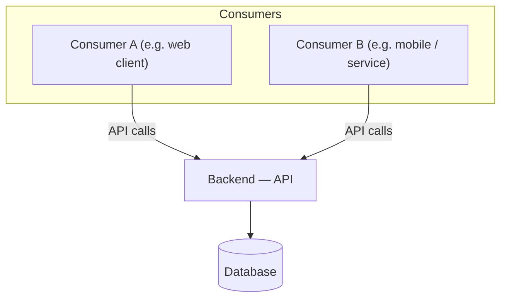

# Repo Map

<!-- TODO: This is the registry the root `CLAUDE.md` router points at. Keep it current:
     one row per repo. The router stays tiny by deferring the detail to this file. -->

The repos in this workspace, what each does, and where its docs live.

| Repo | Role | Stack | Docs |
|---|---|---|---|
| `api` _(example)_ | Backend — serves the API, owns the DB & auth | <!-- TODO: language/framework --> | [`docs/api/`](./docs/api/) <!-- TODO --> |
| <!-- TODO: repo --> | <!-- TODO: role --> | <!-- TODO: stack --> | <!-- TODO: docs path --> |
| <!-- TODO: repo --> | <!-- TODO: role --> | <!-- TODO: stack --> | <!-- TODO: docs path --> |
| <!-- TODO: repo --> | <!-- TODO: role --> | <!-- TODO: stack --> | <!-- TODO: docs path --> |

## How they connect

These repos are **not** wired together by static imports — they are independent codebases
that talk over the **API at runtime**. The backend *serves* the API; the other repos
*consume* it over the network. That runtime edge is the "spine" of the system and is
documented by hand in [`docs/_shared/api-contract.md`](./docs/_shared/api-contract.md).

Because there is no static link between repos, a code-graph tool (Graphify) cannot draw
the connection — it only sees within a repo. Cross-repo understanding therefore comes from
the contract and this map, not from a generated graph.

- **Contract / spine:** [`docs/_shared/api-contract.md`](./docs/_shared/api-contract.md)
- **Auth across repos:** [`docs/_shared/auth-model.md`](./docs/_shared/auth-model.md)
- **Environments:** [`docs/_shared/env-matrix.md`](./docs/_shared/env-matrix.md)
- **Run it all locally:** [`docs/_shared/local-setup.md`](./docs/_shared/local-setup.md)

## Diagram

<!-- TODO: Fill in real repo names and services. This shows the runtime API links
     (not static imports). Rename/add nodes to match your system. -->

